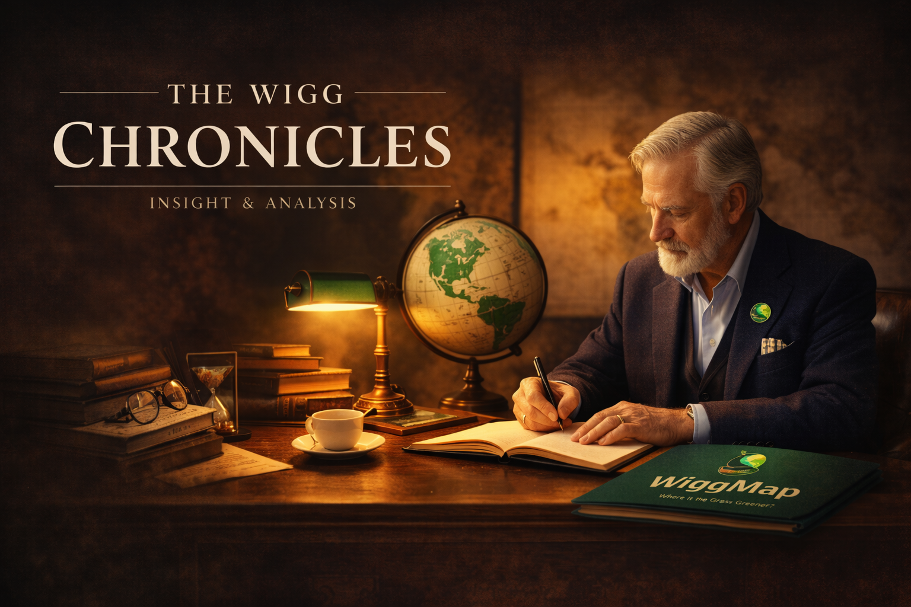

# WiggMap — Philosophie éditoriale & Voix "Wigg"

## Ce qu'est WiggMap

Un hybride entre plateforme de comparaison + média de découverte + outil d'aide à la décision + univers ludique + futur espace communautaire. Pas un simple blog. Pas un outil purement technique.

**Question centrale :** *"Where is the grass greener?"*

**Cible :** personnes curieuses du monde, envisageant un changement de vie, digital nomads, expatriés, familles, retraités à l'étranger, crypto holders — mais aussi n'importe qui qui aime comprendre comment le monde fonctionne ailleurs.

**Auteur de tous les articles :** "Wigg" / "By Wigg"

---

## La voix "Wigg" — règle non-négociable

Tout contenu WiggMap doit sonner comme écrit par un être humain intelligent, curieux, bien informé et bien voyagé. **Jamais par une IA.**

### Ton attendu
- Humain, fluide, vivant, attractif
- Informatif sans être froid
- Data-riche mais accessible
- Smart sans être académique
- Crédible sans être rébarbatif

### Ce qui fonctionne
- Ouvrir sur une histoire humaine concrète, un paradoxe ou une scène avant d'aller aux données
- Donner du contexte aux chiffres : *"$500/mois vs $1 400/mois — un écart de 2,8× qui reflète deux niveaux économiques fondamentalement différents"*
- Expliquer ce que les chiffres signifient dans la vie quotidienne, pas juste les lister
- Pull quotes qui capturent une tension ou un paradoxe — pas un fait répété
- Détails spécifiques et recherchés qui montrent que c'est vraiment travaillé
- Toujours pros ET cons — jamais de pure promotion

### Exemple bon opener
*"Work no longer has borders. But it now has a framework — thresholds, visas, and a tax code that can turn a 'great deal' into an administrative dead end."*

### Exemple mauvais opener
*"Dans cet article, nous allons comparer le coût de la vie dans plusieurs pays."*  
*"In this article we will cover..."*

### Ce qu'il ne faut jamais faire
- Commencer par "Dans cet article nous allons..." ou "In this article we will..."
- Phrases creuses ou génériques
- Répéter les mêmes formules d'un article à l'autre
- Ton robotique, scolaire, froid
- Listes à puces de faits génériques sans contexte
- Simplifier une nuance juridique pour fluidifier

---

## Règles sur les données

- **Jamais copier Numbeo** — chiffres propres WiggMap construits depuis plusieurs sources
- Les données indicatives sont assumées et honnêtes : un loyer en Russie varie énormément, on le dit
- Utiliser `~` pour les approximations + contexte dans le `hint`
- Quand une donnée vient d'une source qui doit être citée → source en fin d'article, discrète, petit format, uniquement les obligatoires
- **Pas de pages surchargées de références** — citer seulement ce qu'on est obligé de citer

---

## Structure d'une chronicle (pattern complet)

1. **Kicker** — ex : "Chronicle · Insight & Analysis"
2. **Titre H1** — keyword en tête, année spécifique ("2026") pour signal de fraîcheur SEO
3. **Deck** — hook en 1-2 phrases, tension ou promesse
4. **Séparateur** ornemental
5. **Lead paragraph long** — scène, atmosphère, ancrage humain. Pas de données encore.
6. **Paragraphe contexte** — pourquoi ce sujet maintenant, quelle question on résout
7. **Pull quote** — tension ou paradoxe clé de l'article
8. **Premier tableau ou dbox** — première salve de données
9. **Sections H2 par pays ou par thème** — chacune avec dbox + analyse nuancée (pros + cons)
10. **Séparateurs** `· · ✦ · ·` entre sections longues
11. **Section FAQ** — `<details>` accordéons, 4-6 questions à intent de recherche réel
12. **Liens internes** — pages pays + chronicles liées
13. **Sources** — uniquement les obligatoires, format discret en fin d'article

### Lead paragraphs : règle absolue
Jamais de données dans le lead. C'est de la scène, du contexte humain, de l'atmosphère. Les données arrivent dans le deuxième ou troisième paragraphe.

---

## Deux styles visuels de chronicles

### Style A — Prospectif / Narratif
*(2056, Élever des enfants, Amériques)*

Palette : fond crème `#f7f5f0`, accent ambré `#92400e`, hero dark brown `#1c1710→#2d2218`

Composants spécifiques :
- `p.lead` avec drop cap (première lettre Fraunces 72px)
- `.toc` plan ancré 2 colonnes
- `.scenario` dark navy box — histoires projetées dans le futur
- `.quote` bordure gauche + fond crème, italique
- `.insight` / `.alert` encadrés colorés
- `.dbox` + `.dbox-grid` grilles de données
- `.tag.green` / `.tag.amber` / `.tag.red`
- `.orn` — `· · ✦ · ·` séparateur entre H2

### Style B — Visa / Guide pratique
*(Série Visa 2026, Healthcare 2026...)*

Palette : fond blanc `#ffffff`, vert `#22c55e`

Composants spécifiques :
- `.visa-section` avec `.visa-num` (cercle vert numéroté)
- `.visa-pills` : `.pill.green` (revenus seuil) / `.pill.blue` (durée) / `.pill.amber` (fiscalité) / `.pill.red` (restriction)
- `.callout` / `.callout-warn` / `.callout-info`
- `.conclusion` profilée par niveau de revenus
- `.internal-links` + `.link-grid`

Structure par entrée pays (3 paragraphes) :
- §1 : conditions exactes (seuil, durée, éligibilité, procédure)
- §2 : nuances, pièges fréquents, ce que les gens comprennent mal
- §3 : cadre de vie réel, pour quel profil exact, verdict pratique

---

## Format hero des chronicles — règle absolue

**Tous les articles** (Style A et B) utilisent le même format de hero. Ne jamais mettre le titre complet de l'article dans le `<h1>` du hero — ça le rend trop imposant.

### HTML du hero (copier-coller exact)

```html
<section class="hero">
  <div class="hero-grid">
    <div class="hero-copy">
      <div class="kicker"><span class="dot"></span>Chronicle · Analysis &amp; Insight</div>
      <div class="series-badge">🏷️ [Thème] [Année]</div>
      <h1>The Wigg Chronicles</h1>        <!-- EN -->
      <!-- <h1>Les Wigg Chroniques</h1>   → FR -->
      <!-- <h1>Las Wigg Crónicas</h1>     → ES -->
      <p class="hero-desc">[Description courte de l'article, 1-2 phrases, 60ch max]</p>
      <div class="hero-badges">
        <span class="badge">[badge 1]</span>
        <span class="badge">[badge 2]</span>
        <span class="badge">⏱ ~XX min read</span>
      </div>
    </div>
    <div class="hero-art">
      
    </div>
  </div>
</section>
```

### CSS hero (identique pour tous les articles)

```css
.hero{width:min(1120px,94vw);margin:22px auto 0;border-radius:26px;overflow:hidden;background:linear-gradient(180deg,#ffffff,#f4f7f6);border:1px solid rgba(0,0,0,.08);box-shadow:0 10px 32px rgba(0,0,0,.08);}
.hero-grid{display:grid;grid-template-columns:1.1fr .9fr;align-items:stretch;min-height:340px;}
.hero-copy{padding:34px 34px 30px;display:flex;flex-direction:column;justify-content:center;}
.kicker{display:flex;align-items:center;gap:10px;font-family:'Poppins',sans-serif;letter-spacing:.22em;text-transform:uppercase;font-size:12px;color:rgba(20,32,26,.70);margin-bottom:12px;}
.kicker .dot{width:7px;height:7px;border-radius:999px;background:var(--green);box-shadow:0 0 0 4px rgba(5,150,105,.15);}
.series-badge{display:inline-flex;align-items:center;gap:8px;background:linear-gradient(135deg,#059669,#10b981);color:#fff;font-family:'Poppins',sans-serif;font-size:11px;font-weight:700;letter-spacing:.12em;text-transform:uppercase;padding:7px 14px;border-radius:999px;margin-bottom:14px;box-shadow:0 4px 12px rgba(5,150,105,.30);}
.hero h1{font-family:'Fraunces',serif;font-weight:700;font-size:clamp(34px,4vw,52px);line-height:1.04;margin:0 0 12px;letter-spacing:-0.01em;}
.hero p.hero-desc{font-family:'Poppins',sans-serif;font-size:16px;line-height:1.65;color:rgba(20,32,26,.78);margin:0 0 18px;max-width:62ch;}
.hero-badges{display:flex;flex-wrap:wrap;gap:10px;margin-top:6px;}
.hero .badge{font-family:'Poppins',sans-serif;font-weight:700;font-size:12px;color:rgba(20,32,26,.75);border:1px solid rgba(0,0,0,.10);background:rgba(255,255,255,.78);padding:7px 10px;border-radius:999px;}
.hero-art{background:radial-gradient(600px 360px at 50% 40%,rgba(5,150,105,.14),transparent 55%);display:flex;align-items:center;justify-content:center;padding:16px;}
.hero-art img{width:100%;max-height:380px;object-fit:contain;border-radius:18px;border:1px solid rgba(0,0,0,.08);box-shadow:0 12px 28px rgba(0,0,0,.12);background:rgba(255,255,255,.90);padding:10px;}
@media(max-width:860px){.hero-grid{grid-template-columns:1fr;}.hero-copy{padding:28px 22px 18px;}}
```

### Points clés à retenir
- `<h1>` = toujours le nom de la section ("The Wigg Chronicles" / "Les Wigg Chroniques" / "Las Wigg Crónicas") — **jamais le titre de l'article**
- Image hero = toujours `../assets/chronicles.png` (chemin relatif depuis `/chronicles/`)
- Fond hero = toujours **blanc/gris clair** (`linear-gradient(180deg,#ffffff,#f4f7f6)`) — pas de dark navy
- `series-badge` = thème + année de l'article (emoji + label court)

---

## Polices selon type de page

| Section | Police |
|---------|--------|
| Homepage | Poppins |
| Pages data / compare | Inter |
| Chronicles — titres display | Fraunces |
| Chronicles — corps de texte | Source Serif 4 |

---

## Règles de traduction FR → EN / ES

- Fidélité totale au master FR : même nombre de §, mêmes sections, mêmes callouts, mêmes chiffres
- Noms de programmes jamais traduits : D8, DE Rantau, LTR Visa, Welcome Stamp, Beckham, NHR/IFICI, DTV, VITEM...
- L'EN doit sonner comme un anglophone natif — pas du FR traduit mot à mot
- L'ES doit sonner comme un hispanophone natif — audience latino-américaine + ibérique
- FR : légèrement plus formel que EN, mais chaud — jamais bureaucratique

### Terminologie canonique

| FR | EN | ES |
|----|----|----|
| titre de séjour | residence permit | permiso de residencia |
| revenus de source étrangère | foreign-source income | ingresos de fuente extranjera |
| résidence fiscale | tax residency | residencia fiscal |
| seuil | threshold | umbral |
| régime Beckham | Beckham regime | régimen Beckham |
| plafond | ceiling / cap | límite / techo |
| ressortissant | national | nacional |
| voie directe | direct pathway | vía directa |
| permis de séjour | residence permit | permiso de residencia |

### Règles contenu visa (Style B)
- Callouts obligatoires pour pays politiquement sensibles (Géorgie, Équateur, Argentine, Turquie, Thaïlande...)
- Ne jamais affirmer "non renouvelable" sans préciser le cadre exact
- Sur toute affirmation fiscale : "mérite vérification selon la nationalité"
- Formulations temporelles : "en vigueur début 2026", "sous conditions"

---

## Terminologie WiggMap

- **WIGG** : système de notation maison (GREEN / YELLOW / RED)
- **Chronicle** : terme WiggMap pour les articles longs formats
- **Wigg** : persona/auteur éditorial de tous les articles
- **dbox** : composant visuel dark-header avec grille de stats clés
- **goDeeper** : section JSON Schema B avec cartes culturelles/pratiques enrichies
- **Snapshot card** : carte sidebar avec capital, population, langues, côté de conduite
- **Persona card** : carte sidebar "pour quel profil ce pays est-il fait ?"
